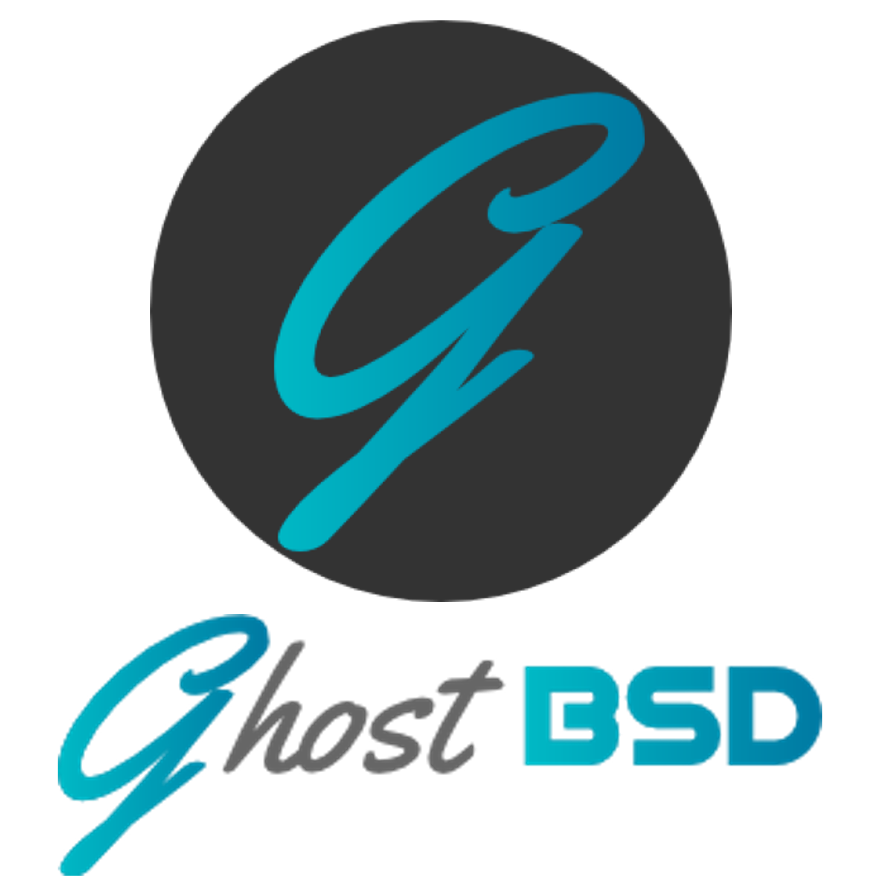
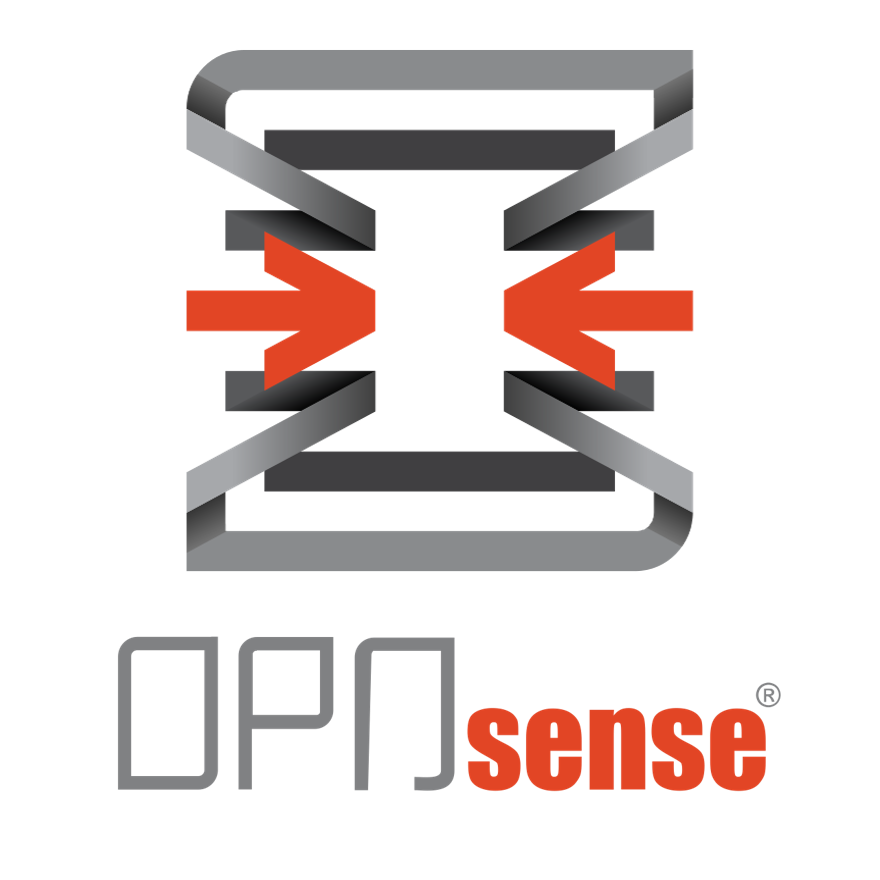
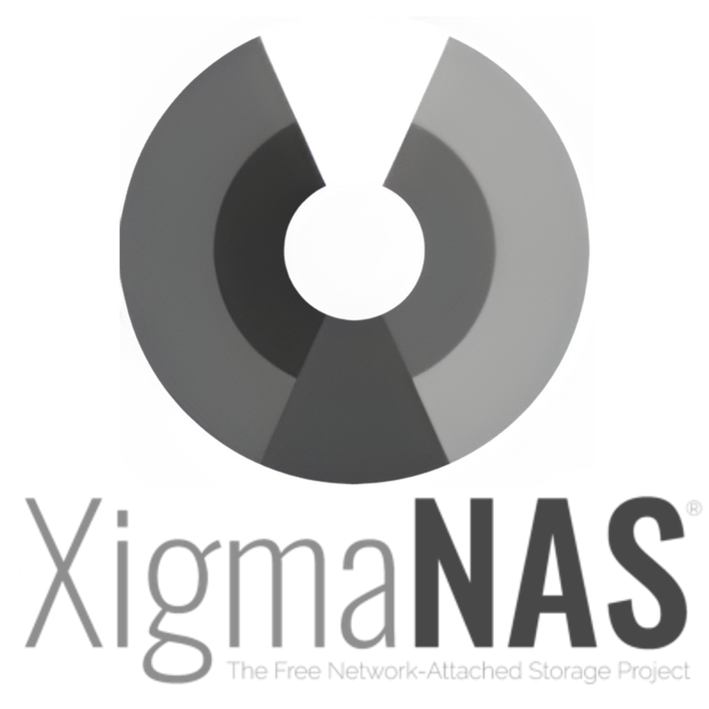

# BSD
Name|Icon
--|--
01-freeBSD|
02-TrueNAS|
03-DragonFly BSD|
04-GhostBSD|
05-OpenBSD|
06-NomadBSD|
07-OPNsense|
08-NetBSD|
09-MidnightBSD|
10-FuguIta|
11-XigmaNAS|
12-HardenedBSD|
13-pfSense|
14-BSD Router Project|
15-helloSystem|
16-DynFi Firewall|
