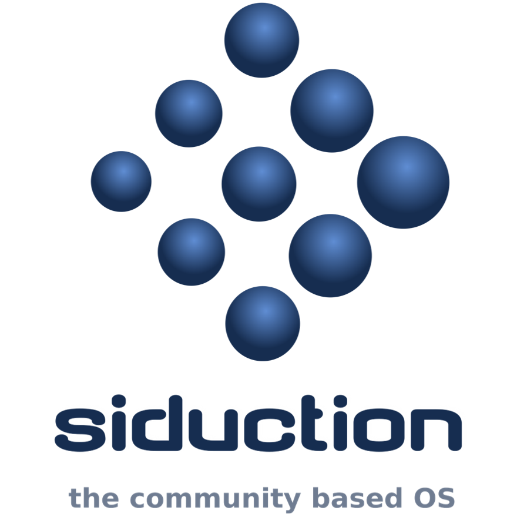

## Logos of Desktop&LiveMedium
Name|Logo
--|--
01-EndeavourOS| 
02-Manjaro| 
03-Pop!_OS| 
04-Garuda| 
05-KDE neon| 
06-SparkyLinux| 
07-Linuxfx| 
08-Peppermint| 
09-Nitrux| 
10-Mabox| 
11-KaOS| 
12-SpiralLinux| 
13-Salix| 
14-RebornOS| 
15-OpenMandriva| 
16-Nobara| 
17-siduction| 
18-Voyager| 
19-Neptune| 
20-NuTyX| 
21-Endless| 
22-GeckoLinux| 
23-ExTiX| 
24-Feren| 
25-ROSA| 
26-Void| 
27-CachyOS| 
28-Legacy| 
29-Zephix| 
30-Ultramarine| 
31-RebecaBlackOS| 
32-Ultimate Edition| 
33-BigLinux| 
34-Venom| 
35-Fatdog64| 
36-risiOS| 
37-SysLinuxOS| 
38-Slackel| 
39-Star| 
40-Obarun| 
41-SolydXK| 
42-Pearl| 
43-Exe| 
44-Canaima| 
45-Refracta| 
46-Diamond| 
47-Swift| 
48-HamoniKR| 
49-PakOS| 
50-Br OS| 
51-mAid| 
52-blendOS| 